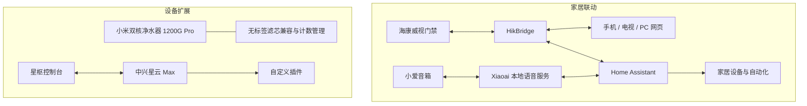
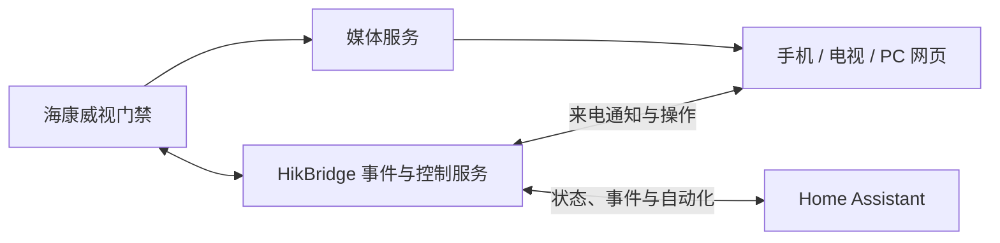
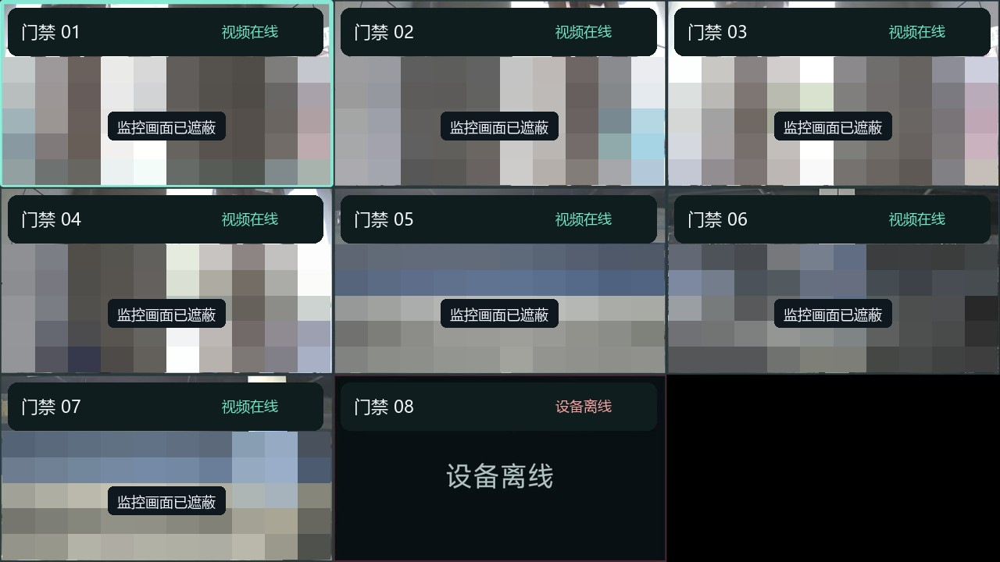
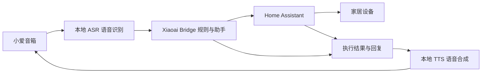
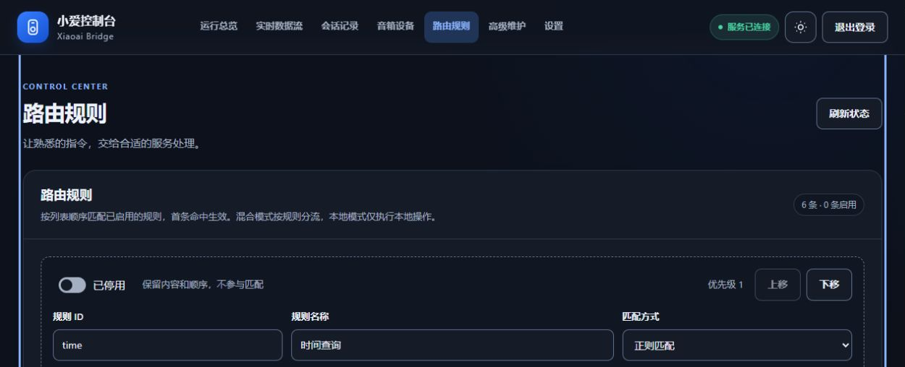
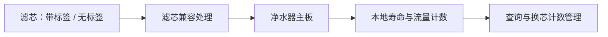
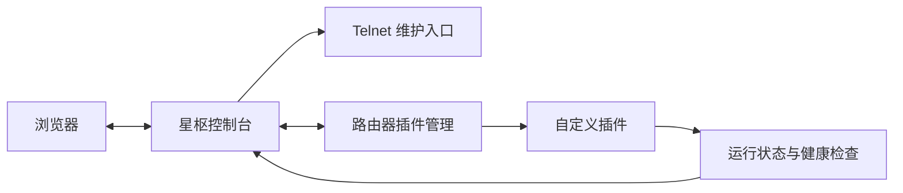

# 智能家居 · 项目进度

记录个人智能家居与设备扩展项目的功能、架构和验证进展。本仓库仅用于 GitHub 公开展示，保存进度说明与脱敏图片。

**整理日期：2026-10-07（北京时间）**。以下内容依据已有项目文档、验收记录和截图整理，代表已记录的进展，不是设备实时状态。

## 项目概览

| 项目 | 目标 | 当前进展 |
| --- | --- | --- |
| **HikBridge** | 海康威视门禁接入 Home Assistant，实现多端来电联动 | 已开发手机端、电视端和 PC 网页端，实现来电推送、通话与门禁解锁，持续优化视频体验 |
| **Xiaoai** | 小爱音箱的本地语音与家居控制 | 已开启支持型号的 SSH，部署本地 ASR / TTS，通过 Home Assistant 执行家居操作，支持多音箱与网页管理 |
| **净水器** | 小米双核净水器 1200G Pro 的滤芯自由 | 已实现 RFID 检测屏蔽与无标签滤芯兼容，完成独立主板安装和计数验证；整机出水与断电保持待验证 |
| **星枢** | 中兴星云 Max 的设备维护与插件扩展 | 已实现 Telnet 开启、自定义插件安装及生命周期管理，有实际安装、升级和运行检查记录 |

## 整体架构

HikBridge 和 Xiaoai 通过 Home Assistant 参与家居联动；净水器与星枢分别承担滤芯兼容和路由器扩展。各项目可以独立维护。

图中仅展示功能关系，省略设备地址、接口、认证和底层实现。

## HikBridge：门禁与多端联动

将海康威视门禁的来电、状态和控制能力接入统一服务。门禁呼叫可以推送至电视、移动端和 Home Assistant，用户可在支持的客户端查看画面、通话及解锁门禁；PC 端提供网页管理与监控界面。

**已记录的进展：**服务端和电视应用已有正式部署记录；设备在线、事件订阅、Home Assistant 联动链路及媒体解码已有验证。近期视频性能实验单独记录，部分仍待发布或电视人工验收。

*使用指定的 `hikbridge_app.jpg` 制作公开副本：门禁名称已匿名化，监控画面已遮蔽。保留原界面布局与在线 / 离线状态。此图展示 App 的多路监控界面。*

## Xiaoai：本地语音与家居控制

在已验证的小爱音箱型号上开启 SSH，将音箱作为语音交互入口。本地 ASR 将语音转换为文字，Xiaoai Bridge 根据规则或助手结果调用 Home Assistant，再通过本地 TTS 生成语音反馈。

**已记录的进展：**支持多音箱独立管理、本地与混合模式、路由规则及会话记录。2026-09-29 验收记录显示 Bridge **2.30.0** / Speech **2.17.3** 已部署，**315 项自动化回归通过**，完成两路并发语音接口验证。

*截取已有验收截图，展示规则管理与优先级操作。截图来自隔离测试环境，规则处于停用状态；未展示个人会话、连接配置和详细匹配内容。*

## 净水器：无标签滤芯兼容

对象为**小米双核净水器 1200G Pro**。项目通过调整设备对 RFID 的处理，让无标签滤芯获得兼容支持，并保留本地寿命与流量计数；支持按滤芯分别配置及与带标签滤芯混用。

**2026-10-07 实机记录的公开摘要：**

| 验证项 | 已记录的结果 |
| --- | --- |
| 默认三芯无标签版本 | 已安装到独立主板，并完成安装结果核验 |
| 滤芯计数 | 安装前后保持原值，单支滤芯计数临时修改、读回和恢复通过 |
| 工具验证 | 45 项测试通过，工具包解压验证通过 |
| 其他混用配置 | 已完成离线验证 |
| 整机验证 | 真实滤芯组合、整机水路、长期运行与物理断电保持完成 |

现阶段成果是滤芯兼容与独立主板验证，尚不能据此认定整机滤芯自由已完成验收；滤芯的尺寸、密封及过滤效果仍需实际验证。已有记录还指出，参数保存途中断电可能丢失计数。

## 星枢：路由器与自定义插件管理

面向**中兴星云 Max**，以独立控制台管理设备维护入口和插件。已实现 Telnet 开启，以及自定义插件的安装、升级、启用、停用和卸载；插件提供扩展功能，控制台统一展示状态与管理入口。

**已有验收记录的公开摘要：**

| 验证项 | 已记录的结果 |
| --- | --- |
| Telnet | 星云 Max 已有成功开启记录 |
| 插件安装与升级 | 自定义代理通过原厂插件管理完成安装 / 升级 |
| 状态核对 | 插件清单、安装版本及实际运行版本已有一致性验证 |
| 运行检查 | 启用状态、代理进程与健康接口已有成功记录 |
| 扩展功能 | 已开展硬件监控、网络诊断与测速功能验证 |

当前验证集中于星云 Max，不能直接推广到其他型号或固件。插件能安装也不等于其全部功能与运行环境都已验证。

## 证据与公开范围

本页使用真实的已有截图，以及项目部署、测试和实机记录的人工整理摘要。截图仅证明图中展示的界面；文中的验证数字和结果来自历史验收记录，本次整理未重新运行测试或操作设备。

本仓库仅保存本页与脱敏图片，不收录源码、固件、安装包、账号、密码、密钥、设备标识、家庭网络地址、个人会话或原始日志。获取进度时只读检查子项目资料，不增删或改写子项目文件。
